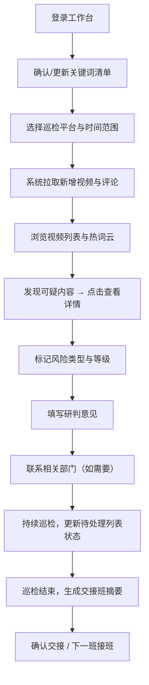

## 1. 产品概述

面向品牌公关值班人员的短视频舆情巡检 Web 工作台，将每日早晚两次巡检流程标准化、数字化。通过关键词清单自动抓取多平台视频与评论，支持风险分级标记与处置跟踪，最终生成可交接的交接班摘要，替代微信群翻找记录的低效工作方式。

- **目标用户**：品牌公关部值班人员、舆情监控专员
- **核心价值**：固定巡检流程、快速识别风险、高效交接班

---

## 2. 核心功能

### 2.1 用户角色

| 角色 | 说明 | 核心权限 |
|------|------|----------|
| 值班人员 | 早晚班舆情巡检执行人员 | 录入关键词、标记风险、生成摘要 |
| 主管（可选） | 审核与复盘人员 | 查看历史记录、导出报告 |

### 2.2 功能模块

1. **巡检清单页**：关键词管理、平台勾选、近几小时新增视频列表、评论热词云、传播苗头提示
2. **风险处置页**：视频详情、风险类型标记（吐槽/投诉/谣言/恶搞/竞品带节奏）、研判意见、待处理列表
3. **交接班摘要页**：高风险视频汇总、播放量变化趋势、评论情绪分析、已联系部门记录

### 2.3 页面详情

| 页面名称 | 模块名称 | 功能描述 |
|---------|---------|----------|
| 巡检清单 | 关键词配置区 | 录入品牌名、产品别称、门店简称、代言人、竞品词；增删改标签 |
| 巡检清单 | 平台选择区 | 勾选抖音、快手、视频号、B站、小红书；默认全选 |
| 巡检清单 | 时间范围选择 | 选择「近2小时/近6小时/近12小时/近24小时」 |
| 巡检清单 | 新增视频列表 | 卡片式展示：平台标识、封面、标题、账号名、发布时间、播放量、点赞数、匹配关键词 |
| 巡检清单 | 评论热词云 | 聚合各视频评论高频词，颜色深浅代表热度，点击可筛选相关视频 |
| 巡检清单 | 传播苗头卡片 | 标识传播速度异常（短时间播放激增）、评论负向率高、带特定话题标签的内容 |
| 风险处置 | 视频详情抽屉 | 点开视频展示：完整信息、评论列表（分页）、数据趋势 |
| 风险处置 | 风险标记面板 | 下拉选择类型（吐槽/投诉/谣言/恶搞/竞品带节奏/无风险）、风险等级（低/中/高/紧急）、研判意见输入框 |
| 风险处置 | 待处理列表 | 左侧栏实时显示所有已标记风险项：类型标签、等级颜色、状态（待处理/处理中/已解决）、操作按钮 |
| 风险处置 | 处置操作 | 标记已联系部门（客服/法务/产品/市场/门店）、添加处理备注、更新状态 |
| 交接班摘要 | 班次信息 | 自动显示日期、班次（早班/晚班）、值班人、交接时间 |
| 交接班摘要 | 高风险汇总 | 列表展示：视频链接（可点击跳转）、风险类型、等级、当前播放量vs巡检初值（变化率高亮）、处理状态 |
| 交接班摘要 | 评论情绪分析 | 饼图/条形图展示正/中/负评论占比，列出Top5负面热词 |
| 交接班摘要 | 协同记录 | 已联系部门列表、沟通要点、待办事项、下一班重点关注 |
| 交接班摘要 | 导出与交接 | 一键生成摘要文本（可复制）、导出PDF、标记「确认交接」 |

---

## 3. 核心流程

值班人员每日早晚两次巡检的标准流程：

---

## 4. 用户界面设计

### 4.1 设计风格

**整体定位**：专业企业级工具 + 冷峻高效的监控仪表盘风格

- **主色调**：深海蓝 `#0F172A`（背景）+ 钢青 `#1E293B`（卡片）
- **强调色**：
  - 紧急/高风险：警示红 `#EF4444`
  - 中风险：琥珀橙 `#F59E0B`
  - 低风险：松石绿 `#10B981`
  - 信息/品牌：电光蓝 `#3B82F6`
- **中性色**：石板灰系列（slate-50 到 slate-900）
- **按钮风格**：扁平直角微圆角（radius 6px），悬停有阴影提升，状态色明确
- **字体**：
  - 标题/数据：`JetBrains Mono`（等宽字体，增强监控感与数据可读性）
  - 正文/描述：`Noto Sans SC`（中文易读）
- **布局风格**：三栏式主布局 + 左侧导航 + 顶部状态栏，卡片化模块分区，网格对齐
- **图标风格**：Lucide 线性图标，统一 16px/20px 尺寸

### 4.2 页面设计概览

| 页面名称 | 模块名称 | UI 元素 |
|---------|---------|---------|
| 巡检清单 | 关键词配置 | 标签式输入框、彩色标签分类（品牌=蓝、产品=紫、门店=绿、代言人=粉、竞品=红） |
| 巡检清单 | 视频卡片 | 平台Logo角标、封面缩略、数据指标行、匹配关键词高亮标签、可疑度指示灯 |
| 巡检清单 | 热词云 | 字号+色阶映射热度、鼠标悬停显示频次、点击筛选联动 |
| 风险处置 | 详情抽屉 | 右侧滑出、半透明遮罩、视频预览（占位）、评论时间线 |
| 风险处置 | 风险标记 | 单选按钮组（emoji+文字）、等级色条、意见输入框（建议提示占位） |
| 风险处置 | 待处理列表 | 优先级排序、色边卡片、状态徽标、快速操作按钮组 |
| 交接班摘要 | 数据指标卡 | 大号数字 + 趋势箭头（↑红↓绿）、环比变化百分比 |
| 交接班摘要 | 风险表格 | 斑马纹、风险等级色条列、播放量变化单元格闪烁动画 |
| 交接班摘要 | 协同记录 | 时间线式气泡、部门标签、责任人署名 |

### 4.3 响应式

- 桌面优先（≥1280px）：三栏/双栏完整布局
- 平板（768-1279px）：收起侧栏为图标模式，视频列表改为双列
- 移动端（<768px）：顶部Tab切换页面，卡片单列、抽屉改为全屏覆盖

### 4.4 动效与细节

- 页面加载：模块级淡入 + 错落延迟（stagger 80ms）
- 风险标记：提交后待处理列表项从右侧滑入 + 高亮闪烁
- 数据指标：数字滚动动画（count-up）
- 热词云：悬停放大 1.1 倍 + 轻微上浮
- 状态变更：徽章颜色切换带渐变过渡
