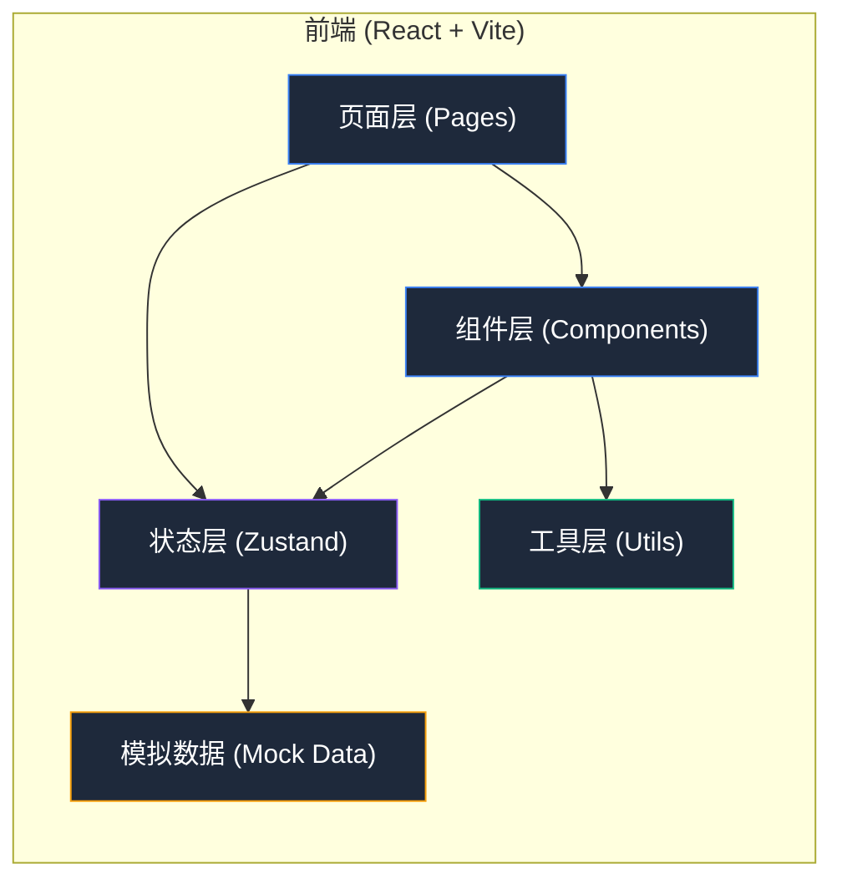

## 1. 架构设计



纯前端单页应用，所有数据使用本地 Mock 数据 + Zustand 状态管理，便于演示与后续对接真实 API。

---

## 2. 技术描述

- **前端框架**：React@18 + TypeScript
- **构建工具**：Vite@6
- **路由**：react-router-dom@6（HashRouter，适配静态部署）
- **状态管理**：zustand@4
- **样式方案**：tailwindcss@3 + 自定义 CSS 变量（设计令牌）
- **图标库**：lucide-react
- **图表方案**：轻量级 CSS/SVG 实现（数字卡、条形图、词云用 DOM 元素），避免引入重型图表库
- **后端**：无（纯前端 Mock 演示）
- **数据持久化**：localStorage（保存关键词配置、处置记录）

---

## 3. 路由定义

| 路由路径 | 页面组件 | 用途 |
|---------|---------|------|
| `/` | `InspectionPage` | 巡检清单页（首页，默认进入） |
| `/risk` | `RiskDisposalPage` | 风险分级处置页 |
| `/handover` | `HandoverPage` | 交接班摘要页 |

---

## 4. 数据模型与类型定义

```typescript
// ===== 基础枚举 =====
type Platform = 'douyin' | 'kuaishou' | 'shipinhao' | 'bilibili' | 'xiaohongshu';
type RiskType = 'complaint' | 'rant' | 'rumor' | 'parody' | 'competition' | 'safe';
type RiskLevel = 'low' | 'medium' | 'high' | 'urgent';
type HandleStatus = 'pending' | 'processing' | 'resolved';
type Department = 'customer_service' | 'legal' | 'product' | 'marketing' | 'store';
type KeywordCategory = 'brand' | 'product' | 'store' | 'ambassador' | 'competitor';
type ShiftType = 'morning' | 'evening';

// ===== 关键词 =====
interface Keyword {
  id: string;
  text: string;
  category: KeywordCategory;
  createdAt: number;
}

// ===== 短视频 =====
interface Video {
  id: string;
  platform: Platform;
  title: string;
  coverUrl: string;
  authorName: string;
  authorAvatar: string;
  publishedAt: number;
  playCount: number;
  likeCount: number;
  commentCount: number;
  shareCount: number;
  matchedKeywords: string[];
  spreadScore: number;       // 传播苗头分数 0-100
  negativeRate: number;      // 负面评论率 0-1
  hotComments: Comment[];
  isNew: boolean;
}

// ===== 评论 =====
interface Comment {
  id: string;
  videoId: string;
  userName: string;
  content: string;
  sentiment: 'positive' | 'neutral' | 'negative';
  likeCount: number;
  createdAt: number;
}

// ===== 热词 =====
interface HotWord {
  word: string;
  frequency: number;
  sentiment: 'positive' | 'neutral' | 'negative';
}

// ===== 风险记录 =====
interface RiskRecord {
  id: string;
  videoId: string;
  riskType: RiskType;
  riskLevel: RiskLevel;
  opinion: string;
  contactDepartments: Department[];
  status: HandleStatus;
  handleNotes: string[];
  initialPlayCount: number;
  currentPlayCount: number;
  createdAt: number;
  updatedAt: number;
  operator: string;
}

// ===== 交接班摘要 =====
interface HandoverSummary {
  id: string;
  date: string;
  shiftType: ShiftType;
  operatorName: string;
  createdAt: number;
  highRiskVideos: RiskRecord[];
  playChanges: { videoId: string; delta: number; deltaPercent: number }[];
  sentimentStats: { positive: number; neutral: number; negative: number };
  contactedDepartments: { dept: Department; points: string; responsible: string }[];
  nextShiftFocus: string[];
  confirmedBy?: string;
}

// ===== 巡检配置 =====
interface InspectionConfig {
  keywords: Keyword[];
  platforms: Platform[];
  timeRangeHours: number; // 2/6/12/24
}
```

---

## 5. 状态管理 (Zustand Store)

单一 Store 组织全局状态，按切片划分：

```typescript
interface AppStore {
  // === 巡检配置切片 ===
  config: InspectionConfig;
  addKeyword: (text: string, category: KeywordCategory) => void;
  removeKeyword: (id: string) => void;
  togglePlatform: (p: Platform) => void;
  setTimeRange: (hours: number) => void;
  
  // === 视频数据切片 ===
  videos: Video[];
  hotWords: HotWord[];
  selectedVideo: Video | null;
  fetchVideos: () => void;  // 触发 mock 生成
  selectVideo: (v: Video | null) => void;
  
  // === 风险处置切片 ===
  riskRecords: RiskRecord[];
  createRiskRecord: (payload: CreateRiskPayload) => void;
  updateRiskStatus: (id: string, status: HandleStatus) => void;
  addHandleNote: (id: string, note: string) => void;
  addContactDepartment: (id: string, dept: Department) => void;
  
  // === 交接班切片 ===
  summaries: HandoverSummary[];
  currentShiftSummary: HandoverSummary | null;
  generateSummary: (operatorName: string, shiftType: ShiftType) => HandoverSummary;
  confirmHandover: (summaryId: string, confirmedBy: string) => void;
}
```

---

## 6. 项目结构

```
src/
├── pages/
│   ├── InspectionPage.tsx      # 巡检清单页
│   ├── RiskDisposalPage.tsx    # 风险处置页
│   └── HandoverPage.tsx        # 交接班摘要页
├── components/
│   ├── layout/
│   │   ├── Sidebar.tsx         # 左侧导航
│   │   ├── TopBar.tsx          # 顶部状态栏
│   │   └── AppLayout.tsx       # 主布局容器
│   ├── inspection/
│   │   ├── KeywordManager.tsx  # 关键词管理
│   │   ├── PlatformFilter.tsx  # 平台筛选
│   │   ├── TimeRangeSelector.tsx
│   │   ├── VideoCard.tsx       # 视频卡片
│   │   ├── VideoList.tsx       # 视频列表
│   │   ├── HotWordCloud.tsx    # 评论热词云
│   │   └── SpreadAlertCard.tsx # 传播苗头
│   ├── risk/
│   │   ├── VideoDetailDrawer.tsx   # 视频详情抽屉
│   │   ├── RiskMarkPanel.tsx       # 风险标记面板
│   │   ├── PendingList.tsx         # 待处理列表
│   │   ├── RiskCard.tsx            # 风险记录卡
│   │   └── DepartmentTagGroup.tsx  # 部门标签组
│   ├── handover/
│   │   ├── ShiftInfoBar.tsx        # 班次信息
│   │   ├── HighRiskTable.tsx       # 高风险汇总表
│   │   ├── SentimentChart.tsx      # 评论情绪图
│   │   ├── CollaborationTimeline.tsx   # 协同记录
│   │   └── SummaryExportPanel.tsx      # 导出面板
│   └── shared/
│       ├── StatCard.tsx            # 数据指标卡
│       ├── RiskBadge.tsx           # 风险徽章
│       ├── PlatformBadge.tsx       # 平台徽章
│       └── EmptyState.tsx          # 空状态
├── store/
│   └── useAppStore.ts          # Zustand Store
├── types/
│   └── index.ts                # 类型定义
├── data/
│   └── mockData.ts             # Mock 数据生成器
├── utils/
│   ├── format.ts               # 数字/时间格式化
│   ├── sentiment.ts            # 情绪颜色映射
│   └── storage.ts              # localStorage 封装
├── App.tsx
├── main.tsx
├── index.css
└── router.tsx
```

---

## 7. Mock 数据设计原则

1. **真实感**：平台分布不均匀（抖音40%、快手25%、视频号20%、B站10%、小红书5%）
2. **时间分布**：近2小时内占30%，2-6小时占40%，6-12小时占20%，12-24小时占10%
3. **风险概率**：约15%视频含中高风险特征（负向评论率>0.4或传播分>80）
4. **评论质量**：每条视频生成5-15条评论，情绪比例随机但关联内容语义
5. **数据关联**：热词从评论中抽取，频次与评论数量正相关
6. **可重复**：使用固定种子函数，刷新不随机大乱，便于演示
